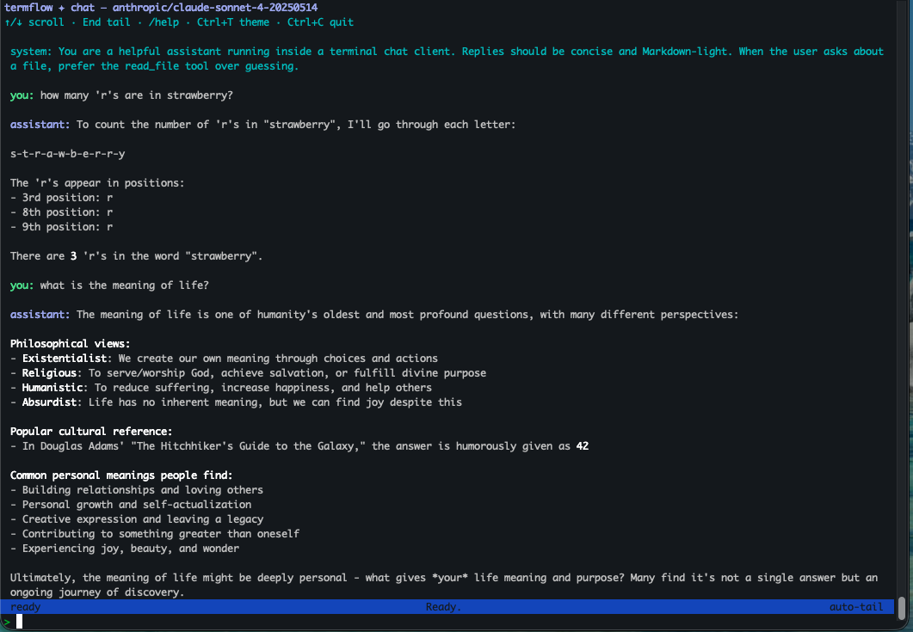

# termflow

[](https://central.sonatype.com/artifact/org.llm4s/termflow_3)
[](https://mit-license.org/)

📖 **[User guide & tutorials → llm4s.github.io/termflow](https://llm4s.github.io/termflow)**

`termflow` is a small, functional terminal UI (TUI) framework for Scala 3.
It uses an Elm-style architecture: a pure `update`, a declarative `view`,
async via `Cmd`, and event streams via `Sub`.

The [docs site](https://llm4s.github.io/termflow) is the primary reference —
elevator pitch, install, tutorials, layer guides, cookbook, and Scaladoc.
This README focuses on building, releasing, and contributing to the repo
itself.



> **Built with TermFlow** — the screenshot above is the
> [`llm4s` chat client](https://github.com/llm4s/llm4s/tree/main/modules/samples/src/main/scala/org/llm4s/samples/chat/tui),
> a streaming Anthropic-API chat REPL written against this library.
> Live transcript with auto-tail, mouse-wheel scrollback, light/dark
> theme toggle, slash commands (`/help`, `/clear`, `/theme`), and a
> pinned bottom prompt — all in a few hundred lines of TermFlow.

## Quick start

```scala
libraryDependencies += "org.llm4s" %% "termflow" % "0.2.0"
```

Then follow [What is TermFlow?](https://llm4s.github.io/termflow/intro/what-is-termflow.html)
and the [Hello, World tutorial](https://llm4s.github.io/termflow/tut/01-hello-world.html).

To poke at the bundled samples:

```bash
sbt hubDemo            # menu launcher for ~22 sample apps
```

The full demo list lives in
[Running sample apps](https://llm4s.github.io/termflow/contrib/RUN_EXAMPLES.html).

## Repository layout

Five published modules plus testkit and samples:

- `modules/termflow-terminal` — TTY backend, key decoding, capability detection.
- `modules/termflow-screen` — character grid, layout, ANSI diff renderer.
- `modules/termflow-app` — Elm-style runtime (`TuiApp`, `Cmd`, `Sub`, `Dialogs`).
- `modules/termflow-widgets` — reusable components (`Button`, `Table`, `Tree`, …).
- `modules/termflow` — umbrella artefact pulling in all four.
- `modules/termflow-testkit` — `TuiTestDriver`, `KeySim`, `MouseSim`, golden-snapshot support (depend on as `% Test`).
- `modules/termflow-sample` — demo apps (not published).
- `modules/termflow-scalafix-rules` — internal scalafix rules for the build.

See [Architecture](https://llm4s.github.io/termflow/intro/architecture.html)
for what each layer does and when to depend on a single one.

## Building

```bash
sbt compile           # Compile (Scala 3)
sbt test              # Run tests
sbt scalafmtAll       # Format
sbt scalafixAll       # Scalafix rewrite
sbt ciCheck           # CI-equivalent local check
sbt prePR             # Format + scalafix + tests + coverage + sample smoke
sbt coverageLib       # Library coverage report
sbt publishLocal      # Publish to local Ivy cache
```

## Scala 3 conventions

- Prefer `enum` for closed ADTs.
- Prefer `given` / `using` over implicit parameters and values.
- Prefer `extension` methods over implicit classes.
- Avoid implicit conversions; return explicit `Tui` values (e.g. `model.tui`).
- Keep migration changes behaviour-preserving unless a PR states otherwise.

## Scala versions

The `main` branch is **Scala 3 only**. The `legacy-213-track` branch is the
Scala 2.13 maintenance line; applicable fixes and critical updates are ported
from `main`.

## Releasing

Versioning is fully driven by git tags via `sbt-dynver`; nothing is hand-edited
in `build.sbt` or a `version.sbt` file.

- A clean checkout of a `vX.Y.Z` tag → version `X.Y.Z` (release).
- Any commit past the latest tag → `X.Y.Z+<N>-<sha>-SNAPSHOT` (snapshot).
- No tags reachable → `0.0.0-UNKNOWN` (CI fallback only).

We follow [early SemVer](https://www.scala-lang.org/blog/2021/02/16/preventing-version-conflicts-with-versionscheme.html)
(`versionScheme := "early-semver"`): in `0.y.z`, a minor bump (`0.1.x → 0.2.0`)
may include breaking changes; patch bumps stay binary-compatible.

### Cutting a release

Releases are published to Maven Central by the `Release` GitHub workflow,
which fires on any pushed tag matching `v[0-9]*`:

```bash
git tag v0.2.1
git push origin v0.2.1
```

The workflow runs `sbt ci-release`, which:

1. Re-runs CI checks.
2. Imports the GPG key from `PGP_SECRET` and signs all artifacts.
3. Stages to the Sonatype Central Portal using `SONATYPE_USERNAME` /
   `SONATYPE_PASSWORD` (these are the **portal user token** values, not your
   Sonatype account login).
4. Releases the staged bundle automatically — no manual "close & release" step.

Artifacts land at `https://repo1.maven.org/maven2/org/llm4s/termflow_3/`
within a few minutes of the workflow finishing.

### Snapshots

Untagged commits on `main` are not auto-published. If you need a snapshot to
test downstream, either tag it (`v0.2.1-RC1`) or run `sbt publishLocal` and
depend on the locally-installed coordinate.

> Note: the legacy `search.maven.org` Solr index is not updated for projects
> publishing through the new Sonatype Central Portal. Use
> [central.sonatype.com](https://central.sonatype.com/artifact/org.llm4s/termflow_3)
> or the raw repo URL above to verify a release.

## Contributing

- [Design](docs/contrib/DESIGN.md) — architectural rationale.
- [Render pipeline](docs/contrib/RENDER_PIPELINE.md) — how a frame becomes ANSI.
- [Roadmap](docs/contrib/ROADMAP.md) — what's left for 1.0 and beyond.
- [Running sample apps](docs/contrib/RUN_EXAMPLES.md) — every demo and its `sbt` alias.
